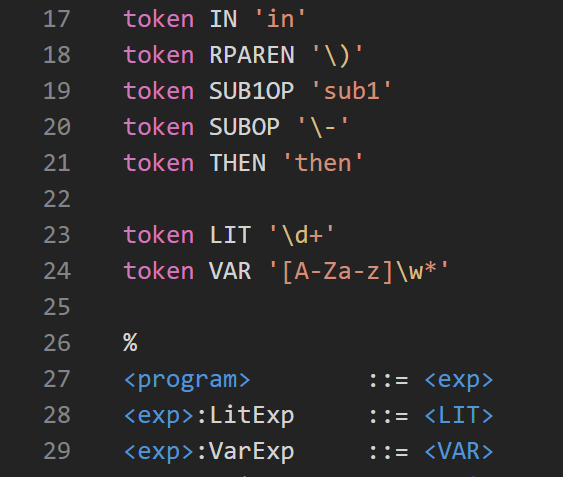

# plcc-syntax-highlighter README

Syntax highlighter for PLCC grammars, a compiler compiler
meant for teaching concepts of programming languages.

## Features

Adds basic syntax highlighting for PLCC grammars.

Here's an example:

## Requirements

No dependencies or anything, just a raw VS Code
language support extension. Should work no problem.

## Installation

I don't think this belongs on the extension marketplace,
so here's a quick summary of the installation:

1. Download all files in this repository put them into
a directory named `plcc-syntax-highlighter`

2. Put that directory into your extensions folder in
VS Code

3. Reload VS Code and you're all set!

#### Made by Maxwell Cohn, an RIT student